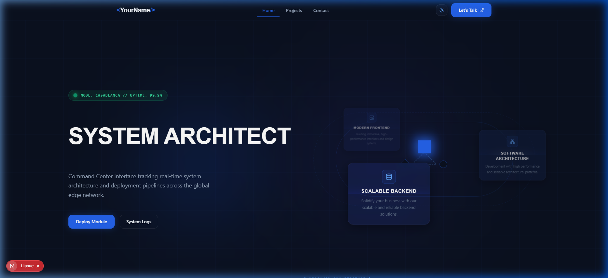
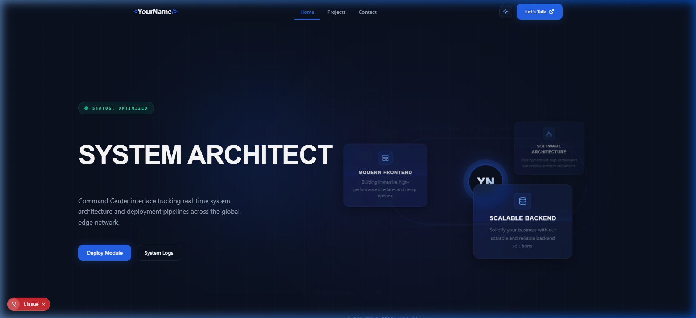
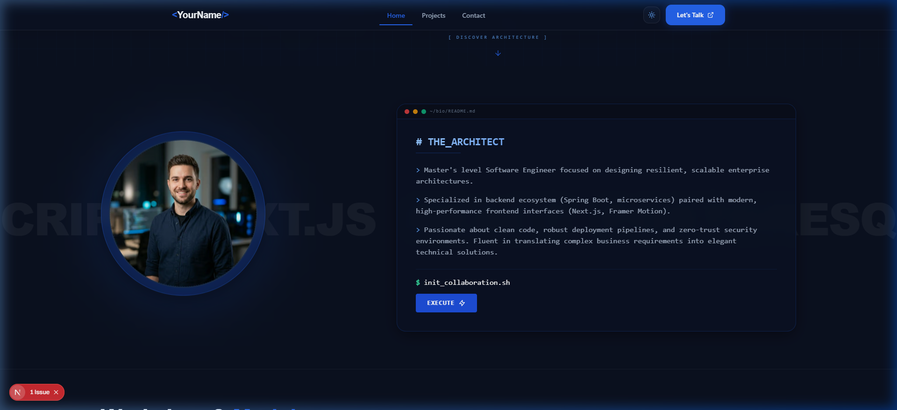
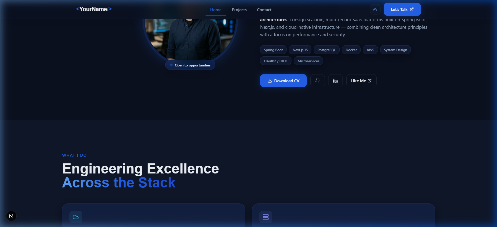
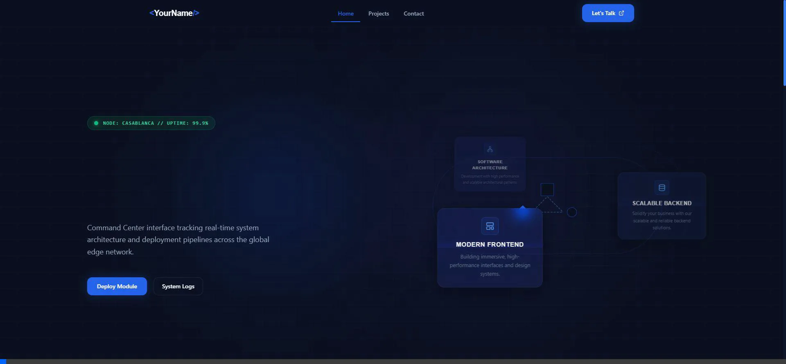
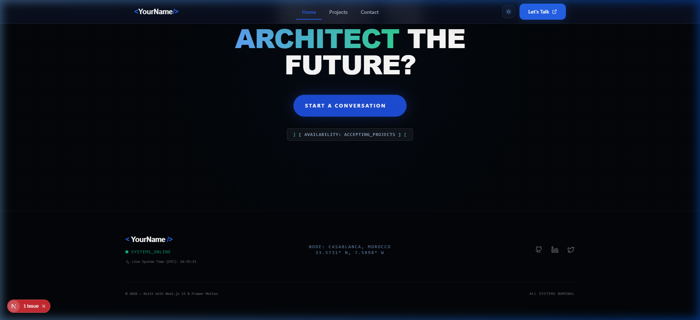
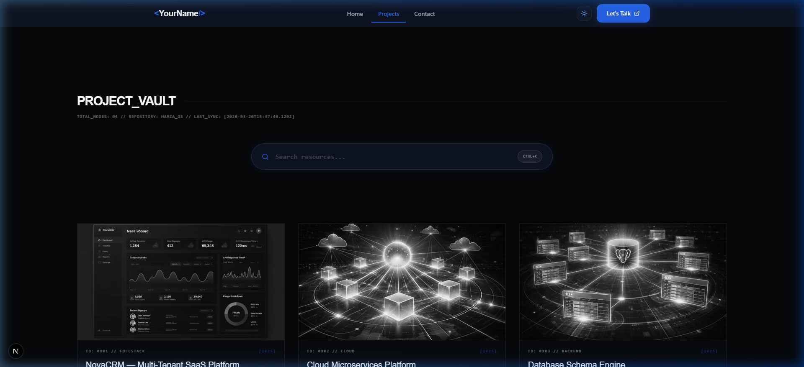
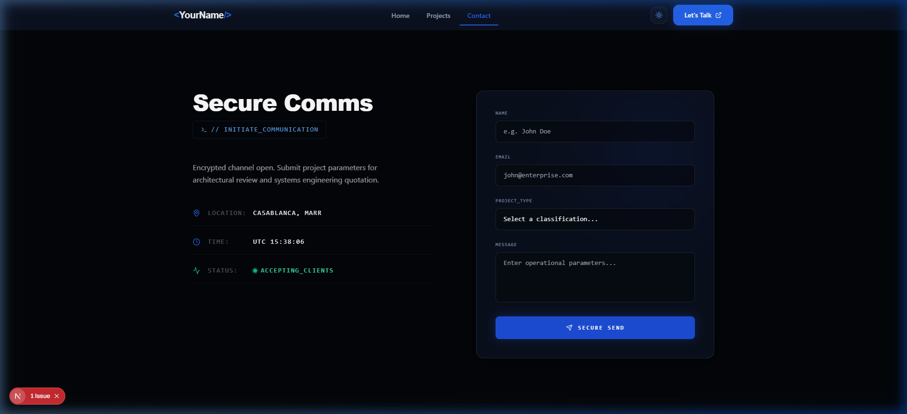

# Minimalist Enterprise Software Engineering Portfolio

A high-fidelity, conversion-oriented Software Engineering portfolio built with Next.js 15, Tailwind CSS, and Framer Motion. Engineered for elite performance, it features a custom 3D Data Console geometry, secure transmission mock terminals, and advanced Framer Motion layout physics.



## Core Architecture

Designed adhering strictly to the "Minimalist Enterprise" aesthetic using a Deep Navy (`#0B1120`) and Cobalt Blue (`#2563EB`) token system.

- **Framework**: Next.js 15 App Router + Turbopack
- **Styling**: Tailwind CSS + Custom CSS (`globals.css` Glassmorphism)
- **Physics**: Framer Motion (`AnimatePresence`, `layout`, `useSpring`, `useMotionValue`)
- **Icons**: Lucide React
- **Data Engine**: `src/lib/mock-data.ts` (Primed for REST/Spring Boot migration)

### The Home Page Architecture
A comprehensive, scroll-revealing layout tailored to convert B2B clients and recruiters via high-fidelity aesthetic layers.

**1. The 3D Orbit Center**


**2. The Identity Matrix (About)**


**3. Enterprise Bento Services**


**4. Parallax Featured Stacks**


**5. System Telemetry Footer**


### The Elite Data Console (Projects Archive)
A rigid 3-column layout powered by an overarching `<VaultHeader>` and a Neon Capsule text-filtration engine. Features include Grayscale-to-Color hover masking, sweeping CSS laser scans, and physical `rotateX/Y` mouse-tracking 5-degree tilts.



### The Secure Contact Terminal
A simulated transmission terminal checking against live UTC local-time vectors and implementing a forced 2-second locked transmission delay state before triggering a Layout Expansion payload.



## Getting Started

1. Clone the repository
2. Install dependencies:
   ```bash
   npm install
   ```
3. Run the development server:
   ```bash
   npm run dev
   ```

## Roadmap & Backend Integration
This frontend architecture actively simulates asynchronous data latency and is formally structured via strict typing to plug directly into a Java Spring Boot API cluster.

> *Engineered by Antigravity AI*
