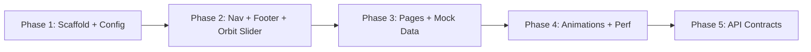

# Technical Project Plan: Software Engineering Business Portfolio

> **Author:** Antigravity AI Architect
> **Date:** 2026-03-26
> **Stack:** Next.js 15+ · Tailwind CSS · Framer Motion · Lucide Icons
> **Aesthetic:** Minimalist Enterprise — Deep Navy Dark Mode / Pure White Light Mode

---

## 1. Project Overview

A premium, conversion-oriented portfolio for a Master's-level Software Engineer from Morocco, targeting technical recruiters and high-ticket B2B clients. The frontend is built first with mock data, designed for seamless future integration with a Spring Boot backend API.

---

## Phase 1: Architecture & Design System

### 1.1 Project Scaffolding

```bash
npx -y create-next-app@latest ./ \
  --typescript \
  --tailwind \
  --eslint \
  --app \
  --src-dir \
  --import-alias "@/*" \
  --turbopack \
  --use-npm
```

**Additional Dependencies:**

```bash
npm install framer-motion lucide-react next-themes clsx
```

### 1.2 Folder Structure

```
src/
├── app/
│   ├── layout.tsx              # Root layout (ThemeProvider, Nav, Footer)
│   ├── page.tsx                # Home page
│   ├── projects/
│   │   ├── page.tsx            # Projects gallery
│   │   └── [id]/
│   │       └── page.tsx        # Cinema project detail page
│   ├── contact/
│   │   └── page.tsx            # Contact form
│   └── globals.css             # Tailwind directives + custom layers
├── components/
│   ├── ui/                     # Atomic UI primitives
│   │   ├── Button.tsx
│   │   ├── Badge.tsx
│   │   ├── GlassCard.tsx
│   │   ├── CommandPalette.tsx
│   │   └── ThemeToggle.tsx
│   ├── sections/               # Page-level sections
│   │   ├── HeroOrbitSlider.tsx
│   │   ├── AboutCard.tsx
│   │   ├── ServicesGrid.tsx
│   │   ├── FeaturedProjects.tsx
│   │   ├── CinemaHero.tsx
│   │   ├── FilmStrip.tsx
│   │   └── ContactForm.tsx
│   └── layout/                 # Structural components
│       ├── Navbar.tsx
│       └── Footer.tsx
├── hooks/
│   ├── useScrollReveal.ts
│   ├── useCommandPalette.ts
│   └── useFormValidation.ts
├── lib/
│   ├── mock-data.ts            # Temporary backend data
│   ├── api.ts                  # API abstraction layer
│   ├── constants.ts            # Site-wide constants
│   └── utils.ts                # Helper functions (cn, formatDate)
├── types/
│   └── index.ts                # All TypeScript interfaces
└── public/
    ├── images/
    │   ├── profile/            # About card photo
    │   └── projects/           # Project screenshots (WebP)
    └── icons/
```

### 1.3 Tailwind Configuration

```typescript
// tailwind.config.ts
import type { Config } from "tailwindcss";

const config: Config = {
  darkMode: "class",
  content: ["./src/**/*.{ts,tsx}"],
  theme: {
    extend: {
      colors: {
        // Core Palette
        navy: {
          DEFAULT: "#0B1120",
          50: "#E8EAF0",
          100: "#C5CAD6",
          200: "#8D96AD",
          300: "#556085",
          400: "#1D2A5C",
          500: "#0B1120",  // Primary dark bg
          600: "#090E1A",
          700: "#070B14",
          800: "#05080E",
          900: "#030508",
        },
        cobalt: {
          DEFAULT: "#2563EB",
          50: "#EFF6FF",
          100: "#DBEAFE",
          200: "#BFDBFE",
          300: "#93C5FD",
          400: "#60A5FA",
          500: "#2563EB",  // Primary accent
          600: "#1D4ED8",
          700: "#1E40AF",
          800: "#1E3A8A",
          900: "#1E3370",
        },
        surface: {
          light: "#FFFFFF",
          "light-secondary": "#F8FAFC",
          dark: "#0F172A",
          "dark-secondary": "#1E293B",
        },
      },
      fontFamily: {
        sans: ["Inter", "system-ui", "sans-serif"],
        display: ["Outfit", "Inter", "sans-serif"],
        mono: ["JetBrains Mono", "monospace"],
      },
      boxShadow: {
        glass: "0 8px 32px rgba(0, 0, 0, 0.12)",
        "glass-dark": "0 8px 32px rgba(0, 0, 0, 0.4)",
        glow: "0 0 20px rgba(37, 99, 235, 0.3)",
        "glow-lg": "0 0 40px rgba(37, 99, 235, 0.2)",
        bento: "0 1px 3px rgba(0,0,0,0.08), 0 1px 2px rgba(0,0,0,0.06)",
      },
      backgroundImage: {
        "gradient-radial": "radial-gradient(var(--tw-gradient-stops))",
        "glass-gradient":
          "linear-gradient(135deg, rgba(255,255,255,0.1), rgba(255,255,255,0.05))",
        "glass-gradient-dark":
          "linear-gradient(135deg, rgba(255,255,255,0.05), rgba(255,255,255,0.02))",
      },
      backdropBlur: {
        glass: "16px",
      },
      borderRadius: {
        bento: "1.25rem",
      },
      spacing: {
        18: "4.5rem",
        88: "22rem",
        128: "32rem",
      },
      animation: {
        "orbit-spin": "orbit-spin 20s linear infinite",
        "fade-up": "fade-up 0.6s ease-out forwards",
        "slide-in": "slide-in 0.5s ease-out forwards",
        shimmer: "shimmer 2s linear infinite",
      },
      keyframes: {
        "orbit-spin": {
          "0%": { transform: "rotate(0deg)" },
          "100%": { transform: "rotate(360deg)" },
        },
        "fade-up": {
          "0%": { opacity: "0", transform: "translateY(20px)" },
          "100%": { opacity: "1", transform: "translateY(0)" },
        },
        "slide-in": {
          "0%": { opacity: "0", transform: "translateX(-20px)" },
          "100%": { opacity: "1", transform: "translateX(0)" },
        },
        shimmer: {
          "0%": { backgroundPosition: "-200% 0" },
          "100%": { backgroundPosition: "200% 0" },
        },
      },
    },
  },
  plugins: [],
};

export default config;
```

### 1.4 Dark/Light Mode Configuration

**Theme Provider** using `next-themes`:

```tsx
// src/app/layout.tsx
import { ThemeProvider } from "next-themes";

export default function RootLayout({ children }) {
  return (
    <html lang="en" suppressHydrationWarning>
      <body>
        <ThemeProvider attribute="class" defaultTheme="dark" enableSystem>
          <Navbar />
          <main>{children}</main>
          <Footer />
        </ThemeProvider>
      </body>
    </html>
  );
}
```

**Theme Toggle Button:**

```tsx
// src/components/ui/ThemeToggle.tsx
"use client";
import { useTheme } from "next-themes";
import { Sun, Moon } from "lucide-react";

export function ThemeToggle() {
  const { theme, setTheme } = useTheme();
  return (
    <button
      onClick={() => setTheme(theme === "dark" ? "light" : "dark")}
      className="p-2 rounded-xl bg-surface-light-secondary dark:bg-surface-dark-secondary
                 hover:bg-cobalt-50 dark:hover:bg-cobalt-900/30 transition-colors"
    >
      {theme === "dark" ? <Sun size={18} /> : <Moon size={18} />}
    </button>
  );
}
```

### 1.5 Global CSS Layer (Glassmorphism Base)

```css
/* src/app/globals.css */
@tailwind base;
@tailwind components;
@tailwind utilities;

@import url("https://fonts.googleapis.com/css2?family=Inter:wght@300;400;500;600;700&family=Outfit:wght@400;500;600;700;800&family=JetBrains+Mono:wght@400;500&display=swap");

@layer components {
  .glass {
    @apply bg-white/70 dark:bg-white/5
           backdrop-blur-[16px]
           border border-white/20 dark:border-white/10
           shadow-glass dark:shadow-glass-dark;
  }

  .glass-card {
    @apply glass rounded-bento p-6;
  }

  .bento-item {
    @apply glass-card hover:shadow-glow
           transition-all duration-300 ease-out
           hover:-translate-y-1;
  }

  .text-gradient {
    @apply bg-gradient-to-r from-cobalt-400 to-cobalt-600
           bg-clip-text text-transparent;
  }

  .section-padding {
    @apply px-6 md:px-12 lg:px-24 py-20 md:py-28;
  }
}
```

---

## Phase 2: Core Components & Layouts

### 2.1 Glassmorphism Navigation

**Design:** Sticky, transparent navbar with glass blur — reveals a solid background on scroll (>50px).

| Feature | Detail |
|---|---|
| Position | `fixed top-0 z-50 w-full` |
| Background idle | Transparent |
| Background scrolled | `glass` class (blur + white/5) |
| Border bottom | `border-b border-white/10` on scroll |
| Logo | `font-display font-bold text-xl` — "YourName" or custom SVG |
| Nav links | Home · Projects · Contact — `text-sm font-medium` |
| CTA | "Let's Talk" button — cobalt filled, glow on hover |
| Mobile | Hamburger → slide-in glass panel from right |

**Scroll Detection Hook:**

```tsx
const [scrolled, setScrolled] = useState(false);
useEffect(() => {
  const handler = () => setScrolled(window.scrollY > 50);
  window.addEventListener("scroll", handler);
  return () => window.removeEventListener("scroll", handler);
}, []);
```

### 2.2 Footer

Minimal 3-column layout:
- **Col 1:** Logo + one-line tagline
- **Col 2:** Quick links (Home, Projects, Contact)
- **Col 3:** Social icons (GitHub, LinkedIn, Twitter/X) using Lucide
- **Bottom bar:** `© 2026 — Built with Next.js`

### 2.3 3D Orbit Slider — Core Logic

The hero section features service icons orbiting a central element. Each icon is placed on a virtual 3D circle using trigonometry.

**Positioning Math (Critical):**

```typescript
// For N items on a circle of radius R, centered at (cx, cy):
// Each item i is placed at angle = (2π / N) * i + rotationOffset

interface OrbitItem {
  id: string;
  label: string;
  icon: LucideIcon;
  angle: number; // current angle in radians
}

function getOrbitPosition(
  angle: number,
  radius: number,
  tiltX: number = 15, // degrees — perspective tilt on X-axis
  tiltY: number = 0
) {
  const x = Math.cos(angle) * radius;
  const y = Math.sin(angle) * radius * Math.cos((tiltX * Math.PI) / 180);
  const z = Math.sin(angle) * radius * Math.sin((tiltX * Math.PI) / 180);

  // Scale and opacity based on z-depth (items behind appear smaller)
  const scale = 0.6 + 0.4 * ((z + radius) / (2 * radius));
  const opacity = 0.4 + 0.6 * ((z + radius) / (2 * radius));
  const zIndex = Math.round(z);

  return { x, y, scale, opacity, zIndex };
}
```

**Framer Motion Variants:**

```tsx
// HeroOrbitSlider.tsx — Framer Motion animation loop

const [rotation, setRotation] = useState(0);

// Auto-rotate
useEffect(() => {
  const interval = setInterval(() => {
    setRotation((prev) => prev + 0.008); // radians per tick
  }, 16); // ~60fps
  return () => clearInterval(interval);
}, []);

// Each orbit item:
<motion.div
  animate={{
    x: position.x,
    y: position.y,
    scale: position.scale,
    opacity: position.opacity,
  }}
  transition={{ type: "spring", stiffness: 100, damping: 20 }}
  style={{ zIndex: position.zIndex }}
  className="absolute glass-card p-4 cursor-pointer"
  whileHover={{ scale: position.scale * 1.15 }}
  onClick={() => handleServiceClick(item.id)}
/>
```

**Center Element:** A pulsing cobalt circle with the user's initials or a logo, using:

```tsx
<motion.div
  animate={{ boxShadow: ["0 0 20px rgba(37,99,235,0.3)", "0 0 40px rgba(37,99,235,0.5)", "0 0 20px rgba(37,99,235,0.3)"] }}
  transition={{ duration: 3, repeat: Infinity }}
  className="w-24 h-24 rounded-full bg-cobalt-500 flex items-center justify-center"
>
  <span className="font-display text-2xl font-bold text-white">YN</span>
</motion.div>
```

---

## Phase 3: Page Implementation & Mock Data

### 3.1 TypeScript Interfaces

```typescript
// src/types/index.ts

export interface Project {
  id: string;
  title: string;
  slug: string;
  excerpt: string;         // Short description (≤120 chars)
  description: string;     // Full markdown content
  category: "backend" | "fullstack" | "mobile" | "cloud";
  tags: string[];           // e.g. ["Spring Boot", "PostgreSQL", "Docker"]
  heroImage: string;        // Primary 16:9 image URL
  thumbnails: string[];     // Film-strip gallery images
  techStack: TechBadge[];
  liveUrl?: string;
  githubUrl?: string;
  featured: boolean;
  completedAt: string;      // ISO date string
  client?: string;
  metrics?: ProjectMetric[];
}

export interface TechBadge {
  name: string;
  icon: string;             // Lucide icon name or custom SVG path
  color: string;            // Hex badge color
}

export interface ProjectMetric {
  label: string;            // e.g. "Uptime"
  value: string;            // e.g. "99.9%"
}

export interface Service {
  id: string;
  title: string;
  description: string;
  icon: string;             // Lucide icon name
  features: string[];
}

export interface ContactFormData {
  name: string;
  email: string;
  company?: string;
  budget?: string;
  message: string;
}

export interface ApiResponse<T> {
  data: T;
  status: number;
  message: string;
  timestamp: string;
}
```

### 3.2 Mock Data File

```typescript
// src/lib/mock-data.ts
import { Project, Service } from "@/types";

export const services: Service[] = [
  {
    id: "cloud",
    title: "Cloud Architecture",
    description: "Designing and deploying scalable, fault-tolerant cloud infrastructure on AWS and Azure.",
    icon: "Cloud",
    features: ["Auto-scaling", "CI/CD Pipelines", "Infrastructure as Code", "Cost Optimization"],
  },
  {
    id: "backend",
    title: "Backend Engineering",
    description: "High-performance REST & GraphQL APIs with Spring Boot, Node.js, and microservices.",
    icon: "Server",
    features: ["Microservices", "Event-Driven", "API Gateway", "Database Design"],
  },
  {
    id: "architecture",
    title: "System Architecture",
    description: "Enterprise-grade system design with a focus on modularity, DDD, and clean architecture.",
    icon: "Layers",
    features: ["Domain-Driven Design", "CQRS", "Hexagonal Architecture", "System Diagrams"],
  },
  {
    id: "security",
    title: "Security & DevOps",
    description: "Zero-trust security models, OAuth2/OIDC integration, and hardened deployment pipelines.",
    icon: "Shield",
    features: ["OAuth2 / JWT", "RBAC", "Container Security", "Penetration Testing"],
  },
];

export const projects: Project[] = [
  {
    id: "1",
    title: "NovaCRM — Multi-Tenant SaaS Platform",
    slug: "novacrm",
    excerpt: "Enterprise CRM with multi-tenant isolation, real-time dashboards, and AI-powered insights.",
    description: "...", // Full markdown description
    category: "fullstack",
    tags: ["Spring Boot", "Next.js", "PostgreSQL", "Docker", "Redis"],
    heroImage: "/images/projects/novacrm-hero.webp",
    thumbnails: [
      "/images/projects/novacrm-dash.webp",
      "/images/projects/novacrm-analytics.webp",
      "/images/projects/novacrm-settings.webp",
    ],
    techStack: [
      { name: "Spring Boot", icon: "Leaf", color: "#6DB33F" },
      { name: "Next.js", icon: "Globe", color: "#000000" },
      { name: "PostgreSQL", icon: "Database", color: "#4169E1" },
    ],
    liveUrl: "https://novacrm.example.com",
    githubUrl: "https://github.com/youruser/novacrm",
    featured: true,
    completedAt: "2025-12-01",
    client: "Internal Product",
    metrics: [
      { label: "Uptime", value: "99.9%" },
      { label: "Response Time", value: "<50ms" },
      { label: "Active Tenants", value: "12" },
    ],
  },
  // ... 3-4 more projects with similar structure
];
```

### 3.3 API Abstraction Layer

```typescript
// src/lib/api.ts
import { projects, services } from "./mock-data";
import type { Project, Service, ApiResponse } from "@/types";

// Simulates network latency for realistic UX testing
const delay = (ms: number) => new Promise((r) => setTimeout(r, ms));

export async function getProjects(category?: string): Promise<ApiResponse<Project[]>> {
  await delay(300);
  const filtered = category
    ? projects.filter((p) => p.category === category)
    : projects;
  return {
    data: filtered,
    status: 200,
    message: "OK",
    timestamp: new Date().toISOString(),
  };
}

export async function getProjectBySlug(slug: string): Promise<ApiResponse<Project | null>> {
  await delay(200);
  const project = projects.find((p) => p.slug === slug) ?? null;
  return {
    data: project,
    status: project ? 200 : 404,
    message: project ? "OK" : "Not Found",
    timestamp: new Date().toISOString(),
  };
}

export async function getServices(): Promise<ApiResponse<Service[]>> {
  await delay(200);
  return {
    data: services,
    status: 200,
    message: "OK",
    timestamp: new Date().toISOString(),
  };
}

export async function submitContact(data: ContactFormData): Promise<ApiResponse<null>> {
  await delay(500);
  console.log("Contact form submitted:", data);
  return {
    data: null,
    status: 201,
    message: "Message sent successfully",
    timestamp: new Date().toISOString(),
  };
}
```

### 3.4 Home Page Sections

| Section | Component | Behavior |
|---|---|---|
| **Hero** | `HeroOrbitSlider` | Full-viewport, 3D orbit animation, tagline + CTA |
| **About** | `AboutCard` | GlassCard with circular photo, name, title, short bio, social links |
| **Services** | `ServicesGrid` | 2×2 Bento grid, each card is a `bento-item` with icon, title, feature list |
| **Featured** | `FeaturedProjects` | 3-column grid of project cards, hover reveals excerpt overlay |

### 3.5 Projects Gallery Page

| Feature | Implementation |
|---|---|
| **Command Palette Search** | `useCommandPalette` hook — listens for `Ctrl+K`, opens modal with fuzzy search over `projects[].title` and `projects[].tags[]` |
| **Category Tabs** | `All · Backend · Fullstack · Mobile` — animated underline indicator using Framer Motion `layoutId` |
| **Project Card** | 16:9 thumbnail, title, tags list, hover scale+shadow animation |
| **Empty State** | Illustrated SVG + "No projects match your search" |

### 3.6 Cinema Project Detail Page — `[id]/page.tsx`

**Layout Structure:**

```
┌────────────────────────────────────────────────────┐
│              HERO IMAGE (16:9, full-width)          │
│         aspect-video w-full object-cover           │
├────────────────────────────────────────────────────┤
│  FILM-STRIP THUMBNAILS (horizontal scroll)          │
│  ┌──────┐ ┌──────┐ ┌──────┐ ┌──────┐ ┌──────┐     │
│  │ img1 │ │ img2 │ │ img3 │ │ img4 │ │ img5 │     │
│  └──────┘ └──────┘ └──────┘ └──────┘ └──────┘     │
├──────────────────────────────┬─────────────────────┤
│                              │                     │
│  PROJECT DESCRIPTION         │  SIDEBAR            │
│  (markdown rendered)         │  ┌─────────────┐   │
│                              │  │ Tech Stack  │   │
│                              │  │ Badges      │   │
│                              │  ├─────────────┤   │
│                              │  │ Live Preview│   │
│                              │  │ GitHub Link │   │
│                              │  ├─────────────┤   │
│                              │  │ Metrics     │   │
│                              │  └─────────────┘   │
│                              │                     │
└──────────────────────────────┴─────────────────────┘
```

**Film-strip Interaction:**
- Horizontal scrollable container: `overflow-x-auto flex gap-3`
- Clicking a thumbnail replaces the hero image with a smooth `AnimatePresence` crossfade
- Active thumbnail has a `ring-2 ring-cobalt-500` indicator

### 3.7 Contact Page

| Field | Type | Validation |
|---|---|---|
| `name` | text | Required, min 2 chars |
| `email` | email | Required, valid email regex |
| `company` | text | Optional |
| `budget` | select | Optional — "< $5K", "$5K–$15K", "$15K–$50K", "$50K+" |
| `message` | textarea | Required, min 20 chars |

**Real-time validation:** `useFormValidation` hook validates on `blur` and on `change` (debounced 300ms). Errors appear with a `motion.div` slide-down animation.

**Submit:** Calls `submitContact()` → shows success toast with `AnimatePresence`.

---

## Phase 4: Interactions & Performance

### 4.1 Scroll-Reveal Animation System

**Custom Hook:**

```typescript
// src/hooks/useScrollReveal.ts
"use client";
import { useEffect, useRef } from "react";
import { useInView, useAnimation } from "framer-motion";

export function useScrollReveal(threshold = 0.2) {
  const ref = useRef(null);
  const isInView = useInView(ref, { once: true, amount: threshold });
  const controls = useAnimation();

  useEffect(() => {
    if (isInView) {
      controls.start("visible");
    }
  }, [isInView, controls]);

  return { ref, controls };
}
```

**Applied Variants:**

| Section | Animation | Delay |
|---|---|---|
| About Card | Fade up + scale from 0.95 | 0ms |
| Service Grid items | Staggered fade up | 100ms each |
| Featured Projects | Staggered slide-in from left | 150ms each |
| Contact form fields | Staggered fade up | 80ms each |

### 4.2 Image Optimization Strategy

| Technique | Implementation |
|---|---|
| **Format** | All images exported as `.webp` (70-80% quality) |
| **Next.js Image** | Use `next/image` with `priority` on hero images, `loading="lazy"` elsewhere |
| **Sizes** | `sizes="(max-width: 768px) 100vw, (max-width: 1200px) 50vw, 33vw"` |
| **Placeholder** | `placeholder="blur"` with `blurDataURL` (10px base64) |
| **Cinema hero** | Max resolution: 1920×1080. Serve responsive variants via Next.js image loader |
| **Film-strip** | Thumbnails: 320×180 (16:9). Lazy-loaded with intersection observer |

### 4.3 Performance Targets

| Metric | Target |
|---|---|
| Lighthouse Performance | ≥ 95 |
| LCP | < 2.0s |
| CLS | < 0.05 |
| FID | < 100ms |
| Bundle size (JS) | < 150KB gzipped |

---

## Phase 5: Backend Integration Preparation

### 5.1 API Endpoint Contract

When the Spring Boot backend is ready, the frontend will swap the mock `api.ts` functions for real HTTP calls. The API follows REST conventions:

| Method | Endpoint | Description | Request Body | Response |
|---|---|---|---|---|
| `GET` | `/api/v1/projects` | List all projects | — | `ApiResponse<Project[]>` |
| `GET` | `/api/v1/projects?category={cat}` | Filter by category | — | `ApiResponse<Project[]>` |
| `GET` | `/api/v1/projects/{slug}` | Single project detail | — | `ApiResponse<Project>` |
| `GET` | `/api/v1/services` | List all services | — | `ApiResponse<Service[]>` |
| `POST` | `/api/v1/contact` | Submit contact form | `ContactFormData` | `ApiResponse<null>` |
| `GET` | `/api/v1/projects/featured` | Featured projects only | — | `ApiResponse<Project[]>` |
| `GET` | `/api/v1/projects/search?q={query}` | Full-text search | — | `ApiResponse<Project[]>` |

### 5.2 JSON Response Contract

All endpoints return a uniform envelope:

```json
{
  "data": { },
  "status": 200,
  "message": "OK",
  "timestamp": "2026-03-26T10:00:00Z"
}
```

Error responses:

```json
{
  "data": null,
  "status": 404,
  "message": "Project not found",
  "timestamp": "2026-03-26T10:00:00Z"
}
```

### 5.3 Integration Switch Pattern

When the backend is ready, the **only file that changes** is `src/lib/api.ts`:

```typescript
// src/lib/api.ts — Production version
const BASE_URL = process.env.NEXT_PUBLIC_API_URL || "http://localhost:8080";

export async function getProjects(category?: string): Promise<ApiResponse<Project[]>> {
  const params = category ? `?category=${category}` : "";
  const res = await fetch(`${BASE_URL}/api/v1/projects${params}`);
  return res.json();
}

// ... same pattern for all endpoints
```

### 5.4 Environment Variables

```bash
# .env.local
NEXT_PUBLIC_API_URL=http://localhost:8080   # Spring Boot dev server
NEXT_PUBLIC_SITE_URL=https://yourname.dev
NEXT_PUBLIC_GA_ID=G-XXXXXXXXXX             # Optional analytics
```

---

## Verification Plan

### Automated Tests

1. **Build verification:**
   ```bash
   npm run build
   ```
   Must complete with zero errors.

2. **Lint check:**
   ```bash
   npm run lint
   ```
   Must pass with no warnings related to our source files.

3. **Type check:**
   ```bash
   npx tsc --noEmit
   ```
   Must pass with zero type errors.

### Manual / Browser Verification

1. **Visual inspection:** Run `npm run dev`, open `http://localhost:3000`, and verify:
   - Dark/light mode toggle works
   - Orbit slider animates smoothly
   - All 4 pages render correctly (Home, Projects, Project Detail, Contact)
   - Glass effects and bento grid display properly

2. **Responsive check:** Resize the browser to mobile (375px) and tablet (768px) widths:
   - Hamburger menu works on mobile
   - Cinema layout stacks (content above sidebar)

3. **Performance:** Run Lighthouse in Chrome DevTools on the home page, target ≥ 90 performance score.

---

## Implementation Order



> [!IMPORTANT]
> Each phase builds on the previous. Phase 3 mock data ensures the entire frontend is functional before any backend work begins.

> [!TIP]
> After Phase 3, the portfolio is fully demoable. Phases 4 and 5 are polish and future-proofing.
